# Solving_7_NP_hard_Problems_with_the_Ising_Model

## Table of contents
<!--ts-->
   * [Overview](#overview)
   * [Usage](#usage)
   * [Algorithm for Ising Model](#algorithm-for-ising-model)
   * [Introduction to the seven NP-hard problems](#introduction-to-the-seven-np-hard-problems)
     * [Asymmetric Traveling Salesman Problem](#asymmetric-traveling-salesman-problem)
     * [Graph Coloring Problem](#graph-coloring-problem)
     * [Graph Partitioning Problem](#graph-partitioning-problem)
     * [Hamiltonian Cycle Problem](#hamiltonian-cycle-problem)
     * [Max Cut Problem](#max-cut-problem)
     * [Set Packing Problem](#set-packing-problem)
     * [Vertex Cover Problem](#vertex-cover-problem)
   * [Optimization of the time complexity](#optimization-of-the-time-complexity)
   * [Benchmarks](#benchmarks)
   * [References](#references)   
<!--te-->


## Overview
   This project solves seven NP-hard Problems with the Ising Model. The seven problems are Asymmetric Traveling Salesman Problem, Graph Coloring Problem, Graph Partitioning Problem, Hamiltonian Cycle Problem, Max Cut Problem, Set Packing Problem, and Vertex Cover Problem.
 
## Usage
   1. Please open the file [src/main.m](./src/main.m), click ``Run``. The GUI Interface will be shown as below.
 
   
 
   2. Please select the problem you want to solve. The GUI Interface will then ask you to enter the input file path.
 
   
 
   3. Enter the input file path. The file path is the relative file path starting from where [src/main.m](./src/main.m) is. For example, your input file path is ``../benchmarks/asymmetric_traveling_salesman/ft53.txt`` if your input file is at ``./benchmarks/asymmetric_traveling_salesman/ft53.txt`` (The relative file path of this README.md).
 
   
 
   4. The GUI Interface will output the graph of your input file. When the program is done, it will output the graph of the configuration of the Ising spins, and the graph of the final result. This document will show what they look like in each NP-hard problem in the following section.
 
## Algorithm for Ising Model
   We construct the Ising Model to perform the simulated annealing algorithm to solve the NP-hard problems. An Ising Model contains Ising spins s<sub>i</sub> and the Hamiltonian *H* and the temperature *T*. The Hamiltonian is a formulation of Ising spins, depending on what problem we are solving. For the optimization problem, the Ising formulation includes term(s) enforcing the constraint(s) of the problem, which is multiplied by a constant *A*. and a term optimizing the objective of the problem, which is multiplied by a constant *B*. We need to ensure that $\frac{A}{B}$ is large enough so that the constraints of the problem are not violated. The objective of the Ising Model is to minimize *H*. The following is the algorithm to reach the ground state of *H*.
   1. We are given the initial *H*, *s*, *T*, and *T<sub>min</sub>*.
   2. We try to flip a spin and calculate the difference of the Hamiltonian $\Delta$ H.
   3. We calculate the probability to flip the spin. The probability is $$P=min(1, e^{\frac{\beta \Delta H)}{T}})$$
   4. We generate a random number *rand* = [0, 1]. If the *P >= rand*, We flip the spin and update *H*.
   5. We go to step to and repeat the process to try to flip every spin.
   6. After trying on every spin, we lower the temperature *T* with the formula $$T=\frac{T}{1+cT}$$, where *c* is a constant.
   7. We go to the step 2 and repeat the process until *T* < *T<sub>min</sub>*.
   We can observe that in step 3 and step 6, we need to lower the temperature to reduce the probability to flip an Ising spin so that the configuration of the Ising spins converges eventually.
   We use [Metropolis–Hastings algorithm](https://en.wikipedia.org/wiki/Metropolis%E2%80%93Hastings_algorithm) to determine if the spin should be flipped.
   We use [Lundy's cooling schedule](https://link.springer.com/article/10.1007/BF01582166) to lower the temperature.
   The pseudocode is shown below.
 
```
s = s_init
T = T_init
H = H_init
while T > T_min
   for i = 1 to |S| do
  	try to flip the ith spin s[i], and ΔH is the difference of the Hamiltonian of in the trial
  	P = min(1, e ^ (β * ΔH / T)) // Probability to flip s[i]
  	Generate a random number rand = [0, 1]
  	if P >= rand then
     	flip s[i] // flip the ith spin
     	H = H_new
  	end if
   end for
   T = T / (1 + c * T)
end while
Output the spin state s as the solution
```
 
## Introduction to the seven NP-hard problems
 
### Asymmetric Traveling Salesman Problem
 
#### Problem Statement
   Given a directed graph *G = (V, E)*, where the each vertex *v* denotes a city each edge *uv* in the graph denotes a path connecting cities and has a weight *W<sub>uv</sub>* associated with it, what is the route with the least sum of the weights that visits each city exactly once and returns to the origin city (i.e. a Hamiltonian cycle)?
 
#### Ising Formulation
   Suppose that the number of node is *n*, and the binary variable *s<sub>u, j</sub> = 1* if vertex u is the j<sup>th</sup> node in the route. The Ising formulation is
   $$A\sum_{v=1}^n (1-\sum_{j=1}^n s_{v, j})^2 + A\sum_{j=1}^n (1-\sum_{v=1}^n s_{v, j})^2 + A\sum_{uv \notin E} \sum_{j=1}^n s_{u, j}s_{v, j+1} + B\sum_{uv\in E} W_{uv} \sum_{j=1}^n s_{u, j}s_{v, j+1}$$
 
   The first term is for the constraint that every vertex must appear exactly once in a cycle. The second term constraints that there must be a j<sup>th</sup> node in the cycle for each j. The third term requires that there should be an energy penalty if *s<sub>u, j</sub>* and *s<sub>v, j+1</sub>* are both 1, and *uv* $\notin$ *E*. Finally, the last term minimizes the sum of the weights of the route.
 
#### Simulation
 
##### Input Graph
 
   
 
##### The configuration of the Ising spins of the output
 
   
 
##### The final graph
   The edges on the final graph are the selected path in the route.
 
   
 
### Graph Coloring Problem
 
#### Problem Statement
   The graph coloring problem can be a decision problem or optimization problem. The decision problem asks: Given a graph *G = (V, E)* and *n* color, is there a way to color the vertices of a graph such that no two adjacent vertices are of the same color? The optimization problem is to obtain the smallest valid *n*. While the Ising formulation is for the decision problem, we solve the optimization problem with the Ising Model. Below are the algorithm.
 
#### Algorithm to solve the optimization problem of the graph coloring problem
   We use the binary search to find the smallest *n*. We first initialize the lower bound of *n* as 1, and the upper bound of *n* as the number of the vertices |*V*|, the result of the number of the colors of the problem *ans_color* as the number of the vertices |*V*|, and the result of the Ising spins *ans_spins* as the initial Ising spin configuration. The input of the Ising Model is the mean *m* of the lowerbound and the upper bound. The Ising Model will tell us if it finds the valid coloring. If it does, the upper bound for the next iteration is *m-1*, and we update *ans_color* to be *m* and *ans_spins* to be the current Ising spin configuration. Otherwise, the lower bound for the next iteration is *m+1*. We iterate the process until the lower bound is greater than the upper bound. Finally, *ans_color* is the smallest number of the color and *ans_spins* is the corresponding Ising spin configuration for this graph *G*. With binary search, the the time complexity of the optimization problem is only *O(log|V|)* times more than the decision problem.
 
#### Ising Formulation
   Suppose that the number of color is *n*, and the binary variable *s<sub>v, i</sub> = 1* if vertex v is color with i<sup>th</sup> color. The Ising formulation is
   $$A\sum_{v=1} (1-\sum_{i=1}^n s_{v, i})^2 + A\sum_{uv \in E} \sum_{i=1}^n s_{u, i}s_{v, i}$$
 
   The first term enforces the constraint that each vertex has exactly one color,and provides an energy penalty each time this is violated and the second term gives an energy penalty each time an edge connects two vertices of the same color. If there is a ground state of this model with *H = 0*, then there is a solution to the coloring problem on this graph with *n* colors.
 
#### Simulation
 
##### Input Graph
 
   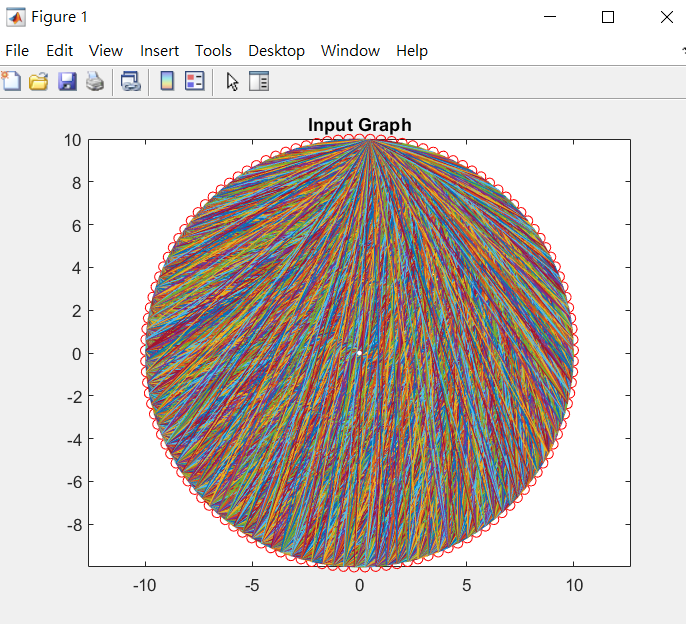
 
##### The configuration of the Ising spins of the output
 
   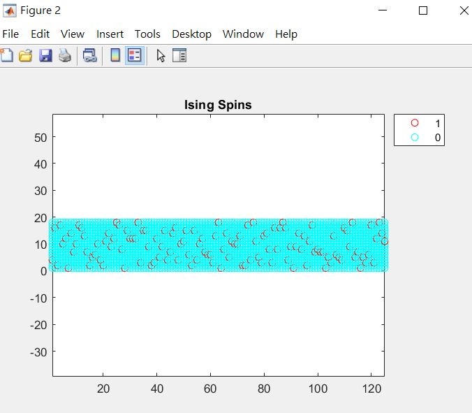
 
##### The final graph
   The graph shows the colors of the vertices.
 
   
 
### Graph Partitioning Problem
 
#### Problem Statement
   Consider an undirected graph *G = (V, E)*. What is a partition of the set *V* into two subsets *S* of the size $\lfloor N/2 \rfloor$ and |*V-S*| of the size $\lfloor (N+1)/2 \rfloor$ such that the number of edges connecting the two subsets is minimized?
 
#### Ising Formulation
   Suppose that the number of the vertices in *G* is *n*, and the binary variable *s<sub>i</sub> = 1* if vertex *i* is placed in set 1 while *s<sub>i</sub> = -1* if vertex *i* is placed in set 2. The Ising formulation is $$A(\sum_{i=1}^n s_i)^2 + B\sum_{uv \in E} \frac{1-s_{u}s_{v}}{2}$$
 
   The first term enforces the constraint that the difference of the sizes of two subsets should equal *N%2*. The second term minimizes the edges connecting two subsets.
 
#### Simulation
 
##### Input Graph
 
   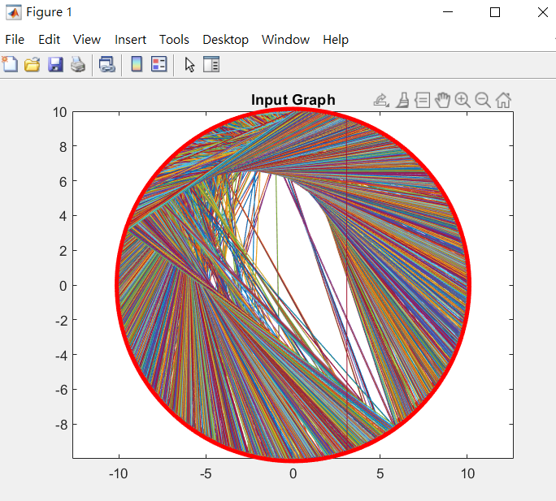
 
##### The configuration of the Ising spins of the output
 
   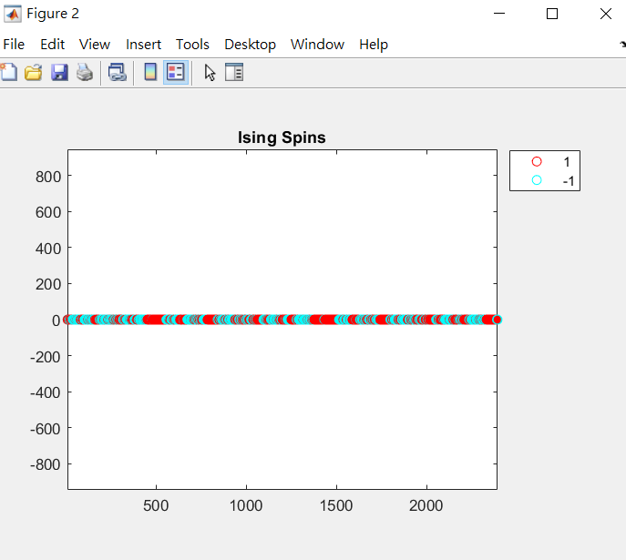
 
##### The final graph
   The vertices in *S* are in red otherwise in cyan. In addition, the graph shows only the edges connecting the two subsets.
 
   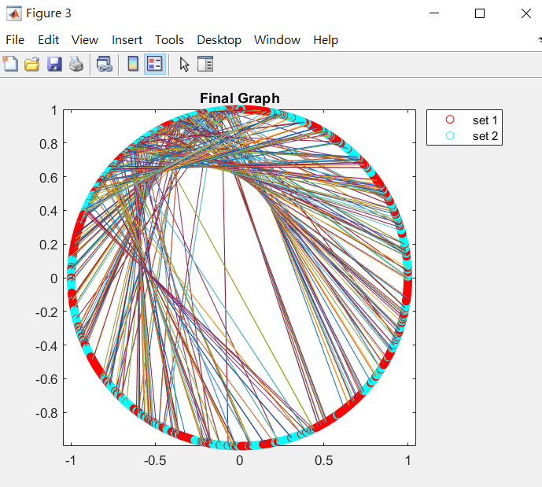
 
### Hamiltonian Cycle Problem
 
#### Problem Statement
   The Hamiltonian cycle problem is the problem of determining whether a Hamiltonian cycle (a cycle in an undirected or directed graph that visits each vertex exactly once except the starting point can be returned from the last node).
 
#### Ising Formulation
   Suppose that the number of node is *n*, and the binary variable *s<sub>u, j</sub> = 1* if vertex u is the j<sup>th</sup> node in the route. The Ising formulation is
   $$\sum_{v=1}^n (1-\sum_{j=1}^n s_{v, j})^2 + \sum_{j=1}^n (1-\sum_{v=1}^n s_{v, j})^2 + \sum_{uv \notin E} \sum_{j=1}^n s_{u, j}s_{v, j+1}$$
 
   The first term is for the constraint that every vertex must appear exactly once in a cycle. The second term constraints that there must be a j<sup>th</sup> node in the cycle for each j. Finally, there should be an energy penalty if *s<sub>u, j</sub>1* and *s<sub>v, j+1</sub>* are both 1, and *uv* $\notin$ *E*.
 
#### Simulation
 
##### Input Graph
 
   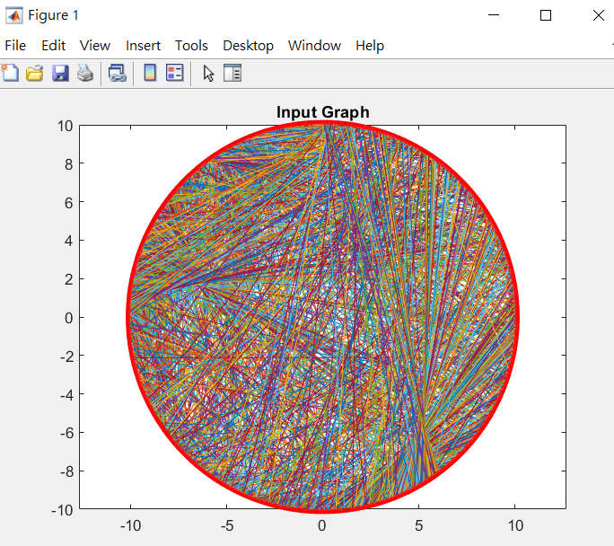
 
##### The configuration of the Ising spins of the output
 
   
 
##### The final graph
   The graph shows the Hamiltonian cycle. Only the edges in the cycle are shown.
 
   
 
### Max Cut Problem
 
#### Problem Statement
   Given a graph *G = (V, E)*, where each edge *uv* in the graph has a weight *W<sub>uv</sub>* associated to it, what is the subset *S* of the vertex set *V* such that total weight of the edges between *S* and *V-S* is maximized?
 
#### Ising Formulation
 
   Suppose that the binary variable *s<sub>i</sub> = 1* if vertex *i* is placed in the *S* while *s<sub>i</sub> = -1* if vertex *i* is placed in the *V-S*. The Ising formulation is $$\sum_{uv \in E}\frac{W_{uv}(s_{u, j}s_{v, j+1} - 1)}{2}$$
 
   The Ising formulation maximizes the sum of the weights of the edges connecting different subsets.
 
#### Simulation
 
##### Input Graph
 
   
 
##### The configuration of the Ising spins of the output
 
   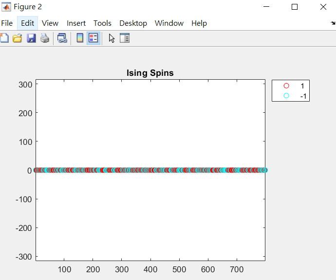
 
##### The final graph
   The vertices is *S* are in red otherwise in cyan. The edges on the graph are the selected cuts.
 
   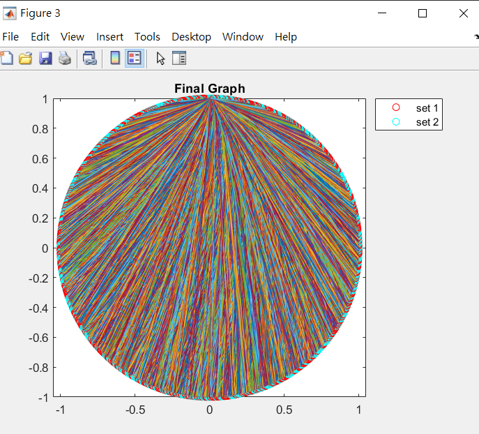
 
### Set Packing Problem
 
#### Problem Statement
   Given a universe *U* and a family *S* of subsets of *U*, a packing is a subfamily *C* $\subseteq$ *S* of sets such that all sets in *C* are pairwise disjoint. The problem is to find a set packing that uses the most sets (i.e. maximize the size of *C* |*C*|).
 
#### Ising Formulation
 
   Suppose that the binary variable *s<sub>i</sub> = 1* if the set *S<sub>i</sub>* is in *C* while *s<sub>i</sub> = 0* if the set *S<sub>i</sub>* is not in *C*. The Ising formulation is $$A\sum_{i:j V_i \bigcap V_j \neq \emptyset}s_is_j - B\sum_{i}^{|S|} s_i$$
 
   The first term enforces the constraint that all set in *C* are pairwise disjoint. The second term maximizes |*C*|.
 
#### Simulation
 
##### Input Graph
 
   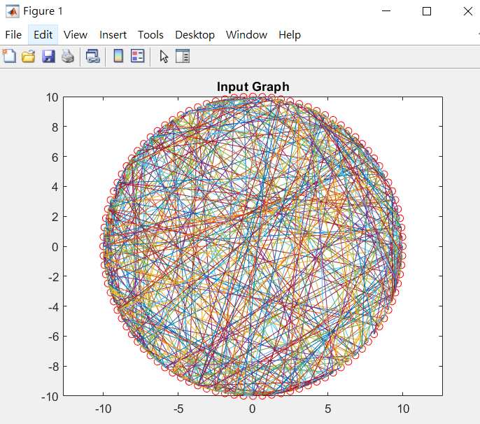
 
##### The configuration of the Ising spins of the output
 
   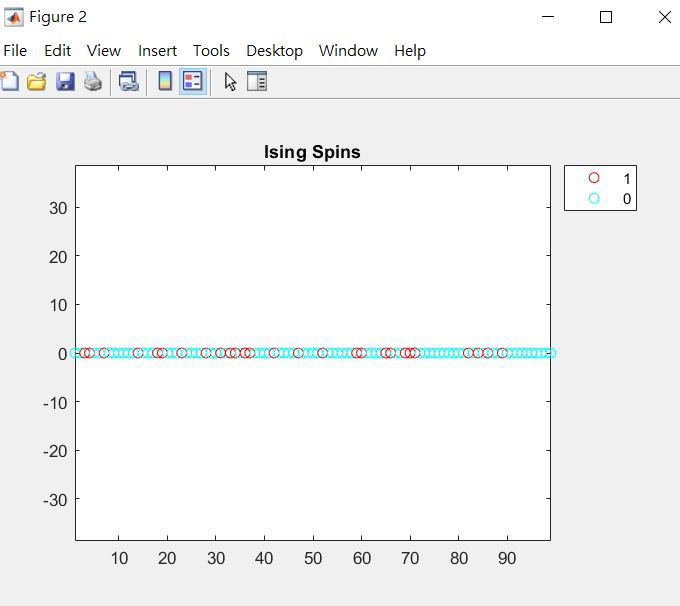
 
##### The final graph
   The vertices on the graph denote the sets. The sets in *C* are in red, otherwise in cyan.
 
   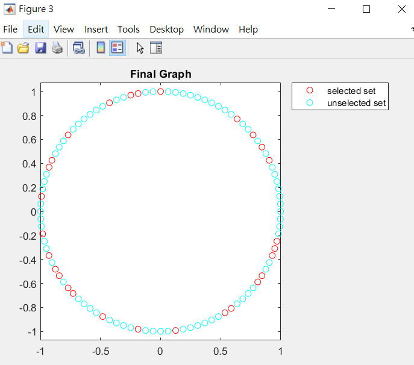
 
### Vertex Cover Problem
 
#### Problem Statement
   Given an undirected graph *G = (V, E)*, what is the smallest subset *S* of the vertex set *V* such that every edge is incident to *S*?
 
#### Ising Formulation
 
   Suppose that the binary variable *s<sub>i</sub> = 1* if vertex *i* is in the *S* while *s<sub>i</sub> = 0* if vertex *i* is not in the *S*. The Ising formulation is $$A\sum_{uv \in E}(1-s_u)(1-s_v) + B\sum_{i=1}^{|V|}s_i$$
 
   The first term constraints that every edge is incident to at least one vertex in *S*. The second term minimizes the size of *S*.
 
#### Simulation
 
##### Input Graph
 
   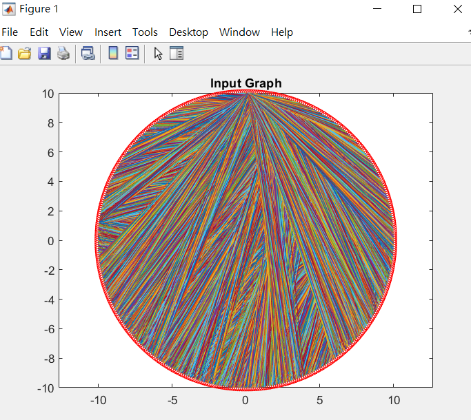
 
##### The configuration of the Ising spins of the output
 
   
 
##### The final graph
   The vertices that are in the subset *S* are in red, otherwise in cyan.
 
   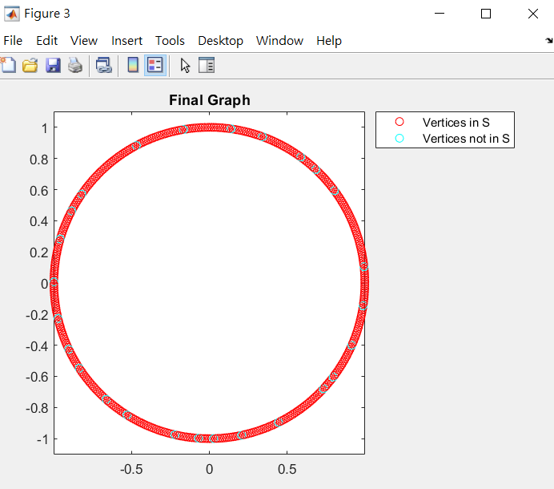
 
## Optimization of the time complexity
   In this project, we reduce the time complexity by calculating the difference of the Hamiltonian $\Delta$*H* instead of the new Hamiltonian *H<sub>new</sub>*. Calculating *H<sub>new</sub>* takes *O(n)* time for 1D summation or *O(n<sup>2</sup>)* for 2D summation. We can reduce the time complexity from *O(n)* to *O(1)* or from *O(n<sup>2</sup>)* to *O(n)* by calculating $\Delta$*H* instead. Take the vertex problem for example. Suppose that we are updating *s<sub>i</sub>*. The first term of the Ising formulation is $$A\sum_{uv \in E}(1-s_u)(1-s_v).$$ It takes *O(n<sup>2</sup>)* time to calculate *H<sub>new</sub>* since we need to enumerate two parameters *u* and *v*. However, the difference of the first term is $$\Delta H_1 = A\sum_{ui \in E}(s_u -1).$$ We can see that *i* is fixed in the formula and we only need to enumerate *u* from 1 to |*S*|. Similarly, the second term is $$B\sum_{i=1}^{|V|}s_i,$$ while the difference of the second term is $$\Delta H_2 = 1 - 2s_i$$ (*s<sub>i</sub>* is either 1 or 0). Therefore, we only need *O(1)* to derive the difference in the second term. Finally, we can obtain *H<sub>new</sub>* by $$H_{new} = H + \Delta H.$$
 
## Benchmarks
   The benchmarks are from well-recognized libraries for the seven problems. The reference link is shown below.
   1. [Asymmetric Traveling Salesman Problem](http://comopt.ifi.uni-heidelberg.de/software/)
   2. [Graph Coloring Problem](https://sites.google.com/site/graphcoloring/vertex-coloring)
   3. [Graph Partitioning](https://chriswalshaw.co.uk/partition/)
   4. [Hamiltonian Cycle Problem](http://comopt.ifi.uni-heidelberg.de/software/TSPLIB95/)
   5. [Max Cut Problem](https://medium.com/toshiba-sbm/benchmarking-the-max-cut-problem-on-the-simulated-bifurcation-machine-e26e1127c0b0)
   6. [Set Packing  Problem](https://www.emse.fr/~delorme/SetPacking.html)
   7. [Vertex Cover  Problem](https://networkrepository.com/bhoslib.php)
 
## References
   1. [Ising formulations of many NP problems](https://www.frontiersin.org/articles/10.3389/fphy.2014.00005/full)
   2. [Convergence of an annealing algorithm](https://link.springer.com/article/10.1007/BF01582166)
   3. [STATICA: A 512-Spin 0.25M-Weight Annealing Processor With an All-Spin-Updates-at-Once Architecture for Combinatorial Optimization With Complete Spin-Spin Interactions](https://ieeexplore.ieee.org/abstract/document/9222223?casa_token=Bc_BPq8h8J4AAAAA:y_Dj7q38aXb881nutQzg0IYGWhxQzjYULRQkDFDKEjqB14x3lQgMajCZdVA6cMSe_7XaWd4)
 
 

